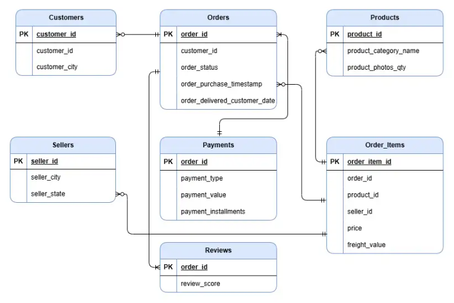

# Olist E-Commerce Sales & Purchase Analysis

## Project Overview
This project focuses on analyzing Olist's e-commerce sales and purchase data to gain insights into key sales trends, product performance, customer behavior, and overall business efficiency. The goal is to provide data-driven recommendations that enhance decision-making for sales, marketing, and product teams.

## Relevant Links
- [View Live Tableau Dashboard](https://public.tableau.com/app/profile/george.bonga/viz/OlistE-commerceSalesPurchaseAnalysis/Dashboard)

## Tools Used
- **Excel**
- **SQL**
- **Power BI**
- **Python**

## Market
- **Ecommerce**

## Background & Overview
Olist is one of Brazil’s leading e-commerce platforms that connects thousands of sellers with millions of customers nationwide. Founded with the vision to democratize online commerce, Olist has grown rapidly by offering a diverse range of products—from fashion and electronics to home goods—across its online marketplace. 

By leveraging an extensive dataset covering customer demographics, orders, payments, product performance, and reviews, this project aims to provide a comprehensive analysis of Olist’s sales and purchase operations. The primary objective is to extract actionable insights that will drive improvements in sales, product management, and marketing strategies.

## Data Cleaning & Integration
Given the heterogeneous nature of the available data—from customer information and orders to payments, product details, and reviews—a robust data cleaning and integration process is critical. This phase involves:

✅ **Data Cleaning:** Identifying and addressing missing values, outliers, and inconsistencies (e.g., date formats, product naming conventions).

✅ **Data Integration:** Merging datasets using unique identifiers (such as `order_id` and `customer_id`) to create a unified master table for analysis.

### Data Cleaning Process
[Click here to view the data cleaning source code](https://github.com/GeorgeBonga/Olist-E-commerce-sales-Purchase-analysis/blob/main/Exploration/Olist_dataset_cleaning.ipynb)

## Olist Database ERD

  

## Executive Summary

The **Olist E-commerce Sales & Purchase Analysis** examines **9,997 orders** from **8,444 unique customers**, generating **$1.72 million in revenue** across **5,887 products**. Revenue is concentrated in key product categories, with **Health & Beauty, Watches & Gifts, and Bed & Bath contributing 25% of total sales**. 

Sales are predominantly driven by customers in **São Paulo, Paraná, and Minas Gerais**, with **credit card payments (74%)** as the preferred payment method. 

Despite stable sales performance, challenges exist in **customer retention**, with a **low repeat purchase rate** and a **high reliance on top-selling categories**. To drive sustained growth, Olist should **expand product diversification, optimize pricing strategies, and enhance customer loyalty programs**. Additionally, **targeted regional expansion** into lower-performing states and **greater adoption of alternative payment methods** can unlock further revenue potential.

---

## Insights Deep-Dive

### Revenue Trends & Growth Patterns
- **Total Revenue:** $1,720,828.22 over **9,997 transactions**, averaging **$172.22 per order**.
- Sales are concentrated in a few high-performing categories, with the **top five contributing over 50% of total revenue**.
- Sales are regionally skewed, with **North and Southeast Brazil driving 80% of revenue**, mirroring national e-commerce trends.

### Top Product Performance
- **Health & Beauty** leads in sales, generating **$151,095.21**, followed by **Watches & Gifts ($146,690.68)** and **Bed, Bath & Table ($138,228.90)**.
- **Monitors and electronics-related categories are underperforming**, representing a potential growth opportunity.
- Lower-priced items, such as **Home Appliances ($12,267.04)** and **Luggage & Accessories ($13,181.47)**, generate significant orders but contribute minimally to overall revenue.

### Customer Behavior & Retention Trends
- The **customer base stands at 8,444**, with an **average of 1.18 orders per customer**, indicating low repeat purchase behavior.
- **74% of transactions occur via credit card**, while **debit card usage remains low (1.47%)**, suggesting room for expanding payment options.
- **Regional spending varies**, with **Rio Branco (Acre) recording the highest single-city sales at $2,879.83**.

---

## Strategic Recommendations

### **1. Product Line Expansion & Bundling**
Strengthen underperforming categories and introduce **strategic product bundles** to increase revenue per transaction.

### **2. Regional Market Penetration**
Focus on **underserved states** to drive market expansion beyond **São Paulo and Paraná**.

### **3. Payment Flexibility & Digital Adoption**
Expand **digital payment options** to encourage higher conversion rates, particularly in **lower-income regions**.

### **4. Customer Loyalty & Retention Programs**
Introduce **personalized offers** and **repeat purchase incentives** to improve **customer lifetime value**.

---

